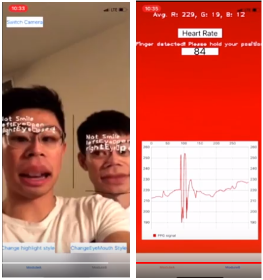
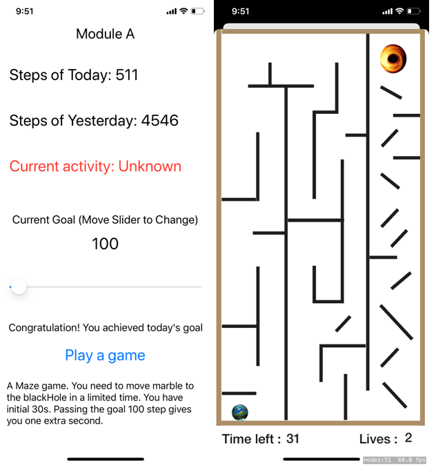
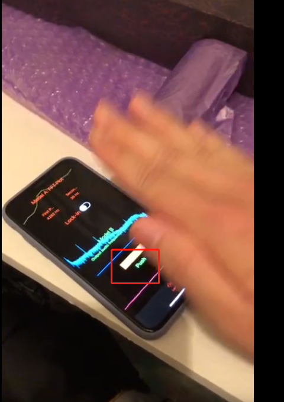
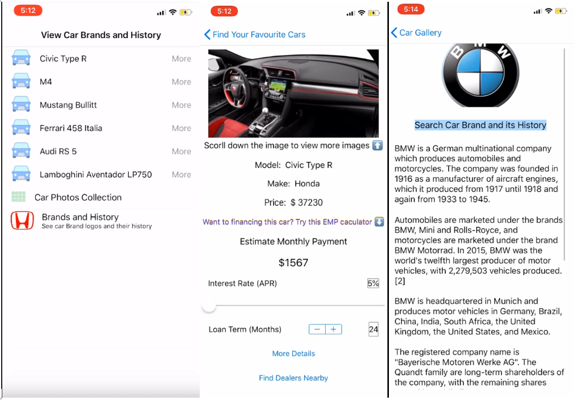

# Mobile Apps for Sensing & Learning
### Xingming Qu, Alex Sun, Zeqi Guo, Siddhika Pravin Ghaisas

We provide introduction video for EACH LAB!
Video: https://drive.google.com/drive/folders/1Sf1LmJClTfwqpBpLC0zxEJk553I-cCrx?usp=sharing

## Final Project - Real Time Face Recognition 

Hi teachers! Are you still annoyed by checking attendance everyday in the class? Do you want to save this time so that you can spend more time on the lecture?
“Check It Out” is an iOS app that helps you to check students’ attendance. With this app, you can simply set up an iphone at the entrance of the classroom and it will perform face recognition to check whether a student attends the class or not when a student is passing the camera. Don’t worry about some “smarty pants” might use a photo to fool the app. We do perform live detection. At the end of the day, the teacher is able to see which students attended the class and which students did not.

Video: https://drive.google.com/file/d/1TH1Inos24XgyLqcGxTcJ8tJyZ5aiJRAJ/view?usp=sharing

## Lab 4 - OpenCV, Image Processing and Heart Rate detection
We have 2 Modules in this lab. 

In the first module, we do some Image Processing stuffs like reads and displays images from the camera in real time, highlights multiple faces and highlights eye and mouth position (We used stupid filters). We can also display if the user is smiling or blinking (and with which eye)

In the second module, we use video of the user's finger (with flash on) to sense a single dimension stream indicating the "redness" of the finger and use the redness to measure the heart rate of the individual (coarse estimate). Finally, we display an estimate of the PPG signal.

## Lab 3 - Core Motion and SpriteKit
We have 2 Modules in this lab. 

In the first module, we display the number of steps a user has walked today and the number of steps a user walked yesterday. We also display the number of steps until the user reaches a (user settable) daily goal. After the user reaches the goal, he or she can play a game!

In the second module, we create a Maze game using SpriteKit. You will control your marble and move it to the target.

## Lab 2 - Audio Filtering, the FFT, and Doppler Shifts
We have 2 Modules in this lab. 

In the first module, we takes an FFT of the incoming audio stream and the app is able to distinguish tones at least 50Hz apart, lasting for 200ms or more.

In the second module, we play a settable (via a slider or setter control) inaudible tone to the speakers (15-20kHz) so that we are able to distinguish when the user is {not gesturing, gestures toward, or gesturing away} from the microphone using Doppler shifts in the frequency

## Lab 1 - iOS Interface Building
In our first lab, we create a basic Car Gallery app.

In this app, you can browse different cars. By clicking the car you want to take a look at, you will be directed to a new page where you can see the specifics of the car, try the Estimate Monthly Payment Calculator.
You can also view Car brands and their history!  

